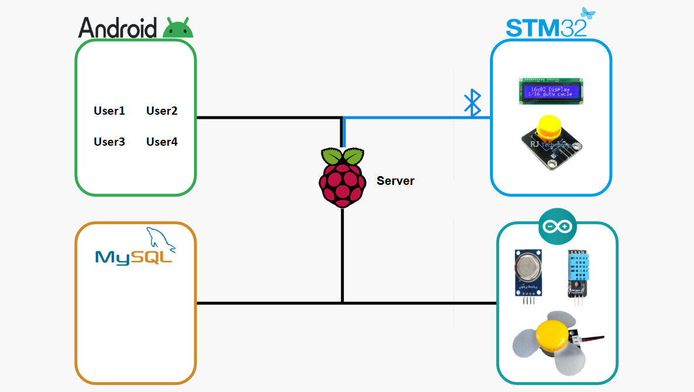
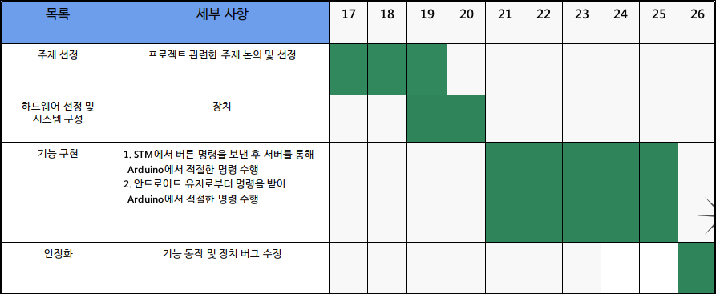
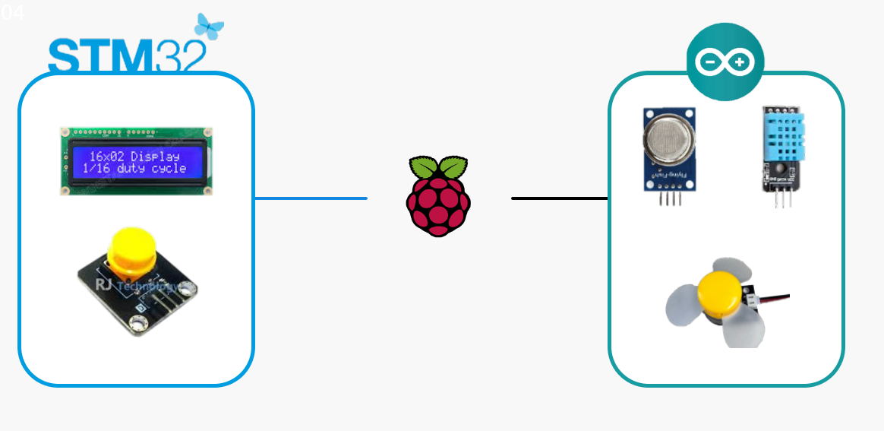

# Shoes Care System

## 팀명: 1조 

### 목차
1. [개요](#개요)
2. [목표](#목표)
3. [시스템 아키텍처](#시스템-아키텍쳐)
4. [개발 진행 상황](#개발-진행-상황)
5. [결과](#결과)
6. [고찰](#고찰)
7. [향후 과제](#향후-과제)
8. [발표 자료](#발표-자료)
---

### 개요
최근 신발 케어 시장의 규모가 지속적으로 성장하고 있으며, 사람들은 신발 관리에서 불편함을 느끼고 있습니다. 특히 신발에서 발생하는 냄새와 습기 문제는 사용자에게 큰 불편을 초래합니다. 이러한 문제를 해결하기 위해, 우리는 신발을 자동으로 관리하고 최적의 상태로 유지할 수 있는 시스템을 개발하기로 하였습니다. 본 프로젝트는 사용자가 언제든지 쾌적한 상태의 신발을 사용할 수 있도록 돕는 신발 관리 시스템을 구현하는 데 중점을 두고 있습니다.

### 목표

본 시스템의 주요 목표는 신발에 발생하는 냄새와 습도를 실시간으로 감지하고 이를 관리하는 것입니다. 이를 통해 신발이 항상 쾌적한 상태로 유지될 수 있도록 하여, 사용자가 신발을 더욱 편리하고 위생적으로 사용할 수 있도록 돕는 시스템을 구축하는 것입니다.

---

### 시스템 아키텍쳐




### 개발 진행 상황



## 결과

### 기능 1

```
● 안드로이드 앱에서 사용자가 선택한 값을 기반으로 신호를 아두이노로 전송합니다. 아두이노는 이 신호를 받아 안드로이드, 데이터베이스, STM에 해당 정보를 전달하고, 각 장치는 이를 처리하여 적절한 동작을 수행합니다.
```


### 기능 2


```
● STM에서는 사용자가 원하는 상태에 따라 팬의 작동 모드를 AUTO, ON, OFF로 설정할 수 있으며, 이에 따라 아두이노 팬의 동작이 제어됩니다.
```


## 고찰
```
● 현재 시스템은 한 번에 하나의 사용자만 데이터를 저장할 수 있습니다.

● 사용자가 로그인하더라도 데이터가 자동으로 받아지지 않아 불편함이 발생합니다.

● 센서에서 측정된 데이터의 정확도가 예상보다 떨어지는 문제가 있습니다.
```

## 향후 과제
```
● MQ135에 있는 데이터시트대로 Rs,R0를 구하여 정확한 값으로 대입할 수 있을 것 같다

● 여러 개의 센서를 통해 하나의 유저에게 자동으로 보내도록 하여 값을 받겠다고 하지 않아도 자동으로 DB에 저장되게 하여 데이터를 쌓을 수 있음

● 안드로이드에서 단순한 수치가 아닌 그래프 방식으로 보이게 하여 더 시각적인 변화를 볼 수 있게 해야 할 것 같음
```

## 발표 자료

# [Shoes Care System](./Shoes%20Care%20System_발표.pptx)


